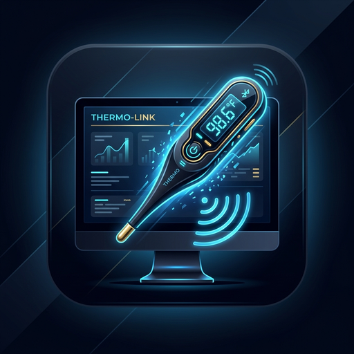

# SpyBLE 📶 - Xiaomi BLE Sensor Dashboard



> **SpyBLE** είναι μια σύγχρονη desktop εφαρμογή (Python / Flet / Bleak) για τον ζωντανό έλεγχο και την παρακολούθηση αισθητήρων Bluetooth Low Energy (BLE) της Xiaomi (Θερμόμετρα LYWSD03MMC και Αισθητήρες Φυτών Mi Flora / VegTrug).

---

## 🌟 Χαρακτηριστικά (Features)

* 🌡️ **Θερμόμετρο LYWSD03MMC**:
  * Ζωντανή μέτρηση Θερμοκρασίας (°C) και Υγρασίας (%).
  * Ένδειξη Τάσης (V) και Ποσοστού Μπαταρίας (%).
* 🌿 **Αισθητήρας Mi Flora (HHCCJCY01)**:
  * Μέτρηση Υγρασίας Χώματος (%).
  * Μέτρηση Αγωγιμότητας / Λιπάσματος (µS/cm).
  * Μέτρηση Θερμοκρασίας (°C) και Φωτεινότητας (Lux).
  * Ένδειξη Μπαταρίας (%).
* 🔍 **Ενσωματωμένος BLE Scanner**: Σάρωση κοντινών συσκευών BLE και αυτόματη ανάθεση MAC διευθύνσεων με ένα κλικ.
* 🎨 **Έγχρωμη Κονσόλα Logs (Multi-color Console)**:
  * 🔴 Κόκκινο για σφάλματα & αποσυνδέσεις.
  * 🟢 Πράσινο για επιτυχείς αναγνώσεις.
  * 🔵 Γαλάζιο για καταστάσεις σύνδεσης.
  * 🟡 Χρυσό για ολοκλήρωση σάρωσης & αποθήκευση.
* 💾 **Μόνιμη Αποθήκευση (Data Persistence)**:
  * Αυτόματη αποθήκευση τελευταίων μετρήσεων στο `config.json`.
  * Άμεση εμφάνιση των προηγούμενων ενδείξεων κατά την εκκίνηση της εφαρμογής.
* ⚡ **Αποκλειστικό Threading**: BLE I/O σε αυτόνομο thread με δικό του `asyncio` event loop ώστε το UI να μην παγώνει ποτέ.
* 🖼️ **Native Splash Screen & Εικονίδιο**: Εγγενής οθόνη υποδοχής και εικονίδιο εφαρμογής κατά την εκκίνηση του `.exe`.
* 🛑 **Καθαρός Τερματισμός**: Άμεσο κλείσιμο διεργασίας χωρίς παραμένοντα zombie processes στο Task Manager.

---

## 🚀 Εγκατάσταση & Εκτέλεση (Setup & Run)

### Προαπαιτούμενα
* Python 3.10+
* [uv](https://github.com/astral-sh/uv) (Package manager)

### Εκτέλεση από τον πηγαίο κώδικα
```bash
# Εγκατάσταση εξαρτήσεων
uv sync

# Εκτέλεση εφαρμογής
uv run python src/main.py
```

---

## 📦 Μεταγλώττιση σε Standalone Executable (.exe)

Για τη δημιουργία αυτόνομου εκτελέσιμου αρχείου Windows:

```bash
uv run pyinstaller SpyBLE.spec --clean --noconfirm
```

Το εκτελέσιμο θα δημιουργηθεί στη διαδρομή: `dist/SpyBLE.exe`

---

## 📄 Δομή Project

```
SpyBLE/
├── src/
│   ├── main.py            # Κύριο UI & Flet Layout (v1.0.2)
│   ├── ble_manager.py     # BLE Polling & Bleak Manager
│   ├── config_manager.py  # JSON Config & Persistent Readings
│   └── assets/            # Εικονίδια & Splash Screen (.png/.jpg/.ico)
├── SpyBLE.spec            # PyInstaller Specification
├── pyproject.toml         # Dependencies & Versioning (uv)
└── README.md              # Τεκμηρίωση Εφαρμογής
```

---

## 👤 Δημιουργός
Ανάπτυξη από **spyalekos**
