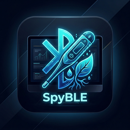

# SpyBLE 📶 - Xiaomi BLE Sensor Dashboard

> **SpyBLE** είναι μια σύγχρονη desktop εφαρμογή (Python / Flet / Bleak) για τον ζωντανό έλεγχο και την παρακολούθηση αισθητήρων Bluetooth Low Energy (BLE) της Xiaomi (Θερμόμετρα LYWSD03MMC και Αισθητήρες Φυτών Mi Flora / VegTrug).

---

## 🌟 Χαρακτηριστικά

* 📊 **Ξεχωριστές Σελίδες/Kαρτέλες (Tabs) Ιστορικού & Εξαγωγή (CSV / JSON)**:
  * 🌡️ **Ιστορικό Θερμομέτρου**: Αυτόματος συγχρονισμός ιστορικών μετρήσεων μνήμης Flash μέσω BLE GATT, προβολή αναλυτικών στατιστικών (Min/Max/Avg) και εξαγωγή σε αρχεία CSV & JSON.
  * 🌿 **Ιστορικό Mi Flora**: Ανάκτηση ιστορικού υγείας φυτού (Υγρασία Χώματος, Λίπασμα, Φωτεινότητα, Θερμοκρασία) και εξαγωγή σε αρχεία CSV & JSON.
* 🎨 **Νέα Εικονίδια & Splash Screen**: Ανανέωση των εικονιδίων της εφαρμογής (`icon.ico`, `icon.png`) και της οθόνης έναρξης (`splash.jpg`) με το λογότυπο **SpyBLE**.
* 🛠️ **Αντιμετώπιση Προβλημάτων Σύνδεσης**: Αναλυτική ενότητα **Αντιμετώπισης Προβλημάτων (Troubleshooting)** στις Οδηγίες (έλεγχος Bluetooth, κλείσιμο εφαρμογής Xiaomi Home/Mi Home στο κινητό λόγω Single Connection Rule, έλεγχος μπαταρίας/απόστασης).
* 🎨 **White & Bold Legibility Styling**: Τα γράμματα και τα εικονίδια στους δείκτες της μεγιστοποιημένης προβολής (Δείκτης Άνεσης & Υγεία Φυτού) είναι **λευκά (`#FFFFFF`) και έντονα (`Bold`)** πάνω από τα έγχρωμα φόντα (πράσινο, πορτοκαλί, κόκκινο, μπλε), εξασφαλίζοντας τέλεια αναγνωσιμότητα.
* ❓ **Κουμπί Βοήθειας & Οδηγιών**: Διαδραστικό κουμπί βοηθείας στην κεφαλίδα της εφαρμογής, το οποίο ανοίγει παράθυρο διαλόγου με αναλυτικές οδηγίες χρήσης, επεξήγηση των μεθόδων BLE, λειτουργία μεγιστοποίησης και ρυθμίσεις.
* 🔲 **Flet Maximize & Focus Mode**: Δυνατότητα μεγιστοποίησης (Fullscreen Focus) είτε του Θερμομέτρου είτε του αισθητήρα Mi Flora με ένα κλικ. Πλήρης εξάλειψη του γκρι πλαισίου (Gray Box Layout Fix) με αφαίρεση `expand=True` από όλα τα στοιχεία του scrollable view. Στη μεγιστοποιημένη προβολή παρέχονται:
  * 🌡️ **Θερμόμετρο**: Υπολογισμός Σημείου Δρόσου (Dew Point), Δείκτης Άνεσης Περιβάλλοντος (Comfort Index), Παρακολούθηση Min/Max συνεδρίας και Μπάρα Μπαταρίας.
  * 🌿 **Mi Flora**: Αυτόματος Διαγνωστικός Έλεγχος Υγείας Φυτού (Πότισμα, Λίπασμα, Φωτισμός), Οπτικές Μπάρες Στάθμης (Progress Bars) για υγρασία, αγωγιμότητα, φως & πληροφορίες Firmware.
* 🚀 **Rapid Shooting Mode (Μέθοδος 2)**: Ταχύτατες συνεχείς ριπές κλήσεων GATT (κάθε 300ms) για άμεση λήψη αρχικών δεδομένων ακόμη και αν η συσκευή BLE βρίσκεται σε κατάσταση εξοικονόμησης ενέργειας.
* 📡 **Passive BLE Scanner (Μέθοδος 3)**: Αυτόματη μετάβαση σε συνεχή παθητική ακρόαση διαφημιστικών πακέτων (BLE Advertisements) για ακαριαία ενημέρωση θερμοκρασίας & υγρασίας (MiBeacon 0xFE95, ATC/PVVX 0x181A, BTHome 0xFCD2).
* 🔍 **Hardware MAC Resolution**: Αυτόματος εντοπισμός και αντιστοίχιση της εσωτερικής Hardware MAC διεύθυνσης από τα διαφημιστικά πακέτα payload, ξεπερνώντας τους περιορισμούς των Random OS Addresses στα Windows.
* 🌡️ **Θερμόμετρο LYWSD03MMC**:
  * Ζωντανή μέτρηση Θερμοκρασίας (°C) και Υγρασίας (%).
  * Ένδειξη Τάσης (V) και Ποσοστού Μπαταρίας (%).
* 🌿 **Αισθητήρας Mi Flora (HHCCJCY01)**:
  * Μέτρηση Υγρασίας Χώματος (%).
  * Μέτρηση Αγωγιμότητας / Λιπάσματος (µS/cm).
  * Μέτρηση Θερμοκρασίας (°C) και Φωτεινότητας (Lux).
  * Ένδειξη Μπαταρίας (%).
* ⏱️ **Ενεργή Επανάληψη (Ρυθμιζόμενη 5s)**: Επιλογή ρυθμού ανανέωσης 5, 10, 30, 60 ή 300 δευτερολέπτων.
* 📜 **Προσαρμοστικό UI με Μπάρα Κύλισης**: Αυτόματη κάθετη κύλιση (Auto Scrollbar) και responsive στοίχιση πάνελ για τέλεια προβολή σε οποιαδήποτε ανάλυση οθόνης.
* 💾 **Μόνιμη Αποθήκευση στο `spyBLE.settings`**: Αυτόματη αποθήκευση ρυθμίσεων και τελευταίων μετρήσεων με αυτόματη μετάβαση από το παλιό `config.json`.
* 🎨 **Έγχρωμη Κονσόλα Logs (Multi-color Console)**:
  * 🔴 Κόκκινο για σφάλματα & αποσυνδέσεις.
  * 🟢 Πράσινο για επιτυχείς αναγνώσεις.
  * 🔵 Γαλάζιο για καταστάσεις σύνδεσης & εκκίνηση Rapid Shooting.
  * 🟡 Χρυσό για ολοκλήρωση σάρωσης & παθητική λήψη.

---

## 🛠️ Αντιμετώπιση Προβλημάτων & Ρυθμίσεις Δικτύου (Firewall)

* 🛡️ **Δικαιώματα Τοπικού Δικτύου & Windows Defender Firewall (`firewall.cpl`)**:
  * Η εφαρμογή αξιοποιεί τοπικούς διαύλους επικοινωνίας (local loopback sockets & network interfaces).
  * Σε περίπτωση σφαλμάτων δικτύου ή αποτυχίας σύνδεσης:
    1. Ανοίξτε την εκτέλεση των Windows (πλήκτρα `Win + R`), πληκτρολογήστε `firewall.cpl` και πατήστε Enter.
    2. Επιλέξτε **«Να επιτρέπεται μια εφαρμογή ή μια δυνατότητα μέσω του Τείχους προστασίας του Windows Defender»**.
    3. Εντοπίστε το **SpyBLE** και επιβεβαιώστε ότι είναι ενεργοποιημένη η πρόσβαση τουλάχιστον στα **Ιδιωτικά Δίκτυα (Private Networks)**.
    4. Εναλλακτικά, εκτελέστε το παρεχόμενο βοηθητικό αρχείο `allow_firewall.bat` με δικαιώματα διαχειριστή για αυτόματη ρύθμιση του κανόνα.
* 📡 **Κανόνας Μίας Σύνδεσης BLE (Single Connection Rule)**:
  * Οι αισθητήρες BLE επιτρέπουν μόνο μία ενεργή σύνδεση master τη φορά.
  * Βεβαιωθείτε ότι η εφαρμογή Xiaomi Home / Mi Home στο κινητό σας είναι κλειστή, ώστε η συσκευή να εκπέμπει ελεύθερα διαφημιστικά πακέτα προς το SpyBLE.
* 🔋 **Μπαταρία & Εμβέλεια**:
  * Ελέγξτε την κατάσταση της μπαταρίας του αισθητήρα (τύπου CR2032) και βεβαιωθείτε ότι η συσκευή βρίσκεται εντός εμβέλειας του Bluetooth του υπολογιστή.
